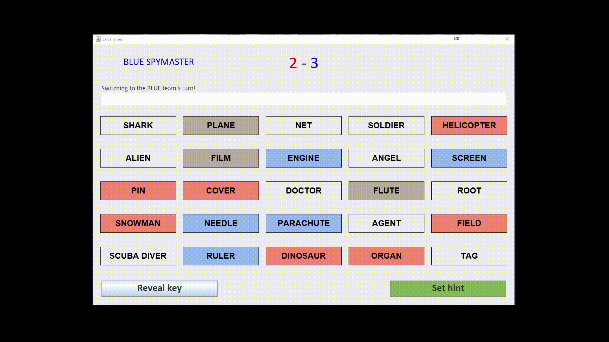

# Codenames
## What is this?

This project was originally a school assignment to create a Java Swing application - I figured why not try to host this online, check it out here: [Codenames Java Swing application](https://codenames.link).

This endeavor turned out to be not as simple as I initially thought, and I ended up utilizing the following tools to make it happen (and reading through A LOT of documentation):

| Technology | Description |
| ------ | ----------- |
| Webswing   | a web server that allows you to run any Java Swing application inside your web browser, using only pure HTML5 |
| NGINX | a reverse proxy that points requests to the WebSwing application |
| AWS Lightsail    | the server that hosts the above two services |

***
## What will the application do?

This application will allow users to play the *Codenames* board game (https://en.wikipedia.org/wiki/Codenames_(board_game)). 

Codenames is a game played by a minimum of 4 users, split across two teams:  **Red**  and  **Blue** .
Each team has a single ***Spymaster*** and the rest of the members are ***Operatives***. The game is played on a 5x5 board with a word occupying each square.
Each team's Spymaster has a hold of the same key - an index of which of the 25 words (representing "*agents*") belong to their respective team. 
The team that starts first has **nine (9)** agents to extract, and other team has **eight (8)** agents to extract. There is one wildcard or "*assassin*" that is to be avoided. The rest of the cards are neutral and do not contribute to winning the game.

The goal of the game is to have alternating Spymasters indicate both a clue and number that best represents the number of agents to be extracted. Clues cannot:
- contain any part of a word on the board
- cannot be phonetically related (i.e. can't rhyme)

Once given a clue (and number of associated agents) the respective team's operative can work together to discuss which words on the grid should be selected. 
Once ready, operatives may select cards one-by-one - in which case there are four outcomes:
1. Your team has correctly selected an agent for your team - your team gets a point and you may continue to guess **up to the number indicated by your Spymaster + 1** or to end your turn
2. Your team has wrongfully selected a neutral card - your turn ends
3. Your team has wrongfully selected the other teams' agent - your turn ends and the other team gets a point
4. Your team has wrongfully selected the assassin - the game immediately ends and you lose!

The game continues until either the first team has extracted all their agents and has won or if the assassin card is revealed.

***
##  Who will use it?

Anyone interested in playing Codenames with a user interface is welcome to play the game.

Seen below is a short .gif of the Blue Spymaster attempting to get their team to guess **Soldier**, **Doctor** and **Agent** with the hint ***Profession***, unfortunately, **Scuba Diver** also falls under this category! The red team takes this opportunity to guess **Alien** and **Angel** via the hint ***Believe*** and they win!

***
##  Known issues

> **Saving and loading of data is disabled**
+ Because the application was exported to a flat JAR file, loading of static data is possible; however, writing to the file is not
+ A possible fix is to create a datastore API that allows users to push to a database and pull from the database (no longer requiring modification of the JAR)
